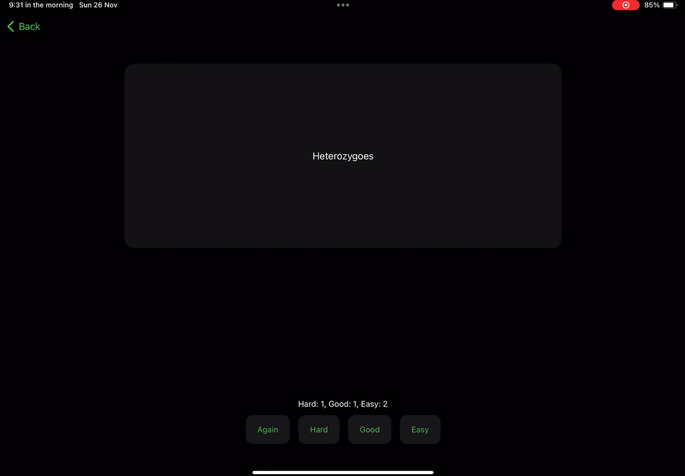
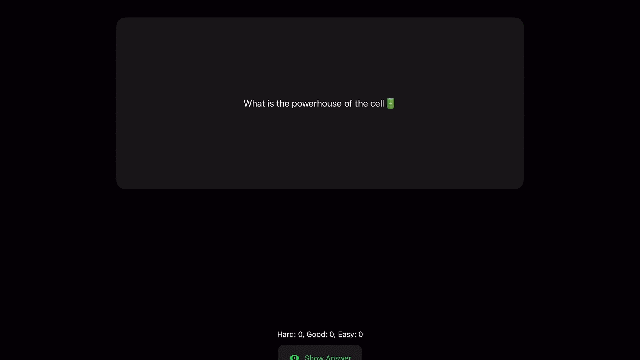

# Brain Palace
## Overview
Brain Palace is an interactive learning app, built entirely with Swift, that combines flashcards — a method of revising by writing questions on one side of a card and the answer on the other — and memory palace — a method of memorizing by associating a familiar spatial environment to a piece of information.

## Flashcards

This method is implemented by creating three stacks: `Hard`, `Good`, and `Easy`. Initially, all flashcards are placed on the `Hard` stack. As the user revises, flashcards move between stacks based on how difficult they are for the user to recall. Those difficult to recall are placed on the `Hard` stack, those recalled successfully but might need more revision are placed on the `Good` stack, and those that were very easy to recall are placed on the `Easy` stack. The revision algorithm prioritizes the `Hard` stack, followed by the `Good` stack. Revision continues until all flashcards are on the `Easy` stack.

## Memory palace

This method uses AR to place a flashcard in a physical space. Users can seamlessly associate a spatial environment with a flashcard by simply tapping on the flashcard they wish to associate. The flashcards listed on the bottom listen for a tap event. After an event is received, the AR algorithm places a red ball in the chosen location, which the user taps to reveal the flash card associated with that specific spatial point. This interactive process allows users to walk around, visually connecting their flashcards with the physical world.

## Demo instructions
To run the demo locally:
1. Install [Swift Playgrounds](https://apps.apple.com/us/app/swift-playgrounds/id908519492) app from the App store.
2. Open the `Brain Palace.swiftpm` on Swift Playgrounds, and press the tap button to run.
